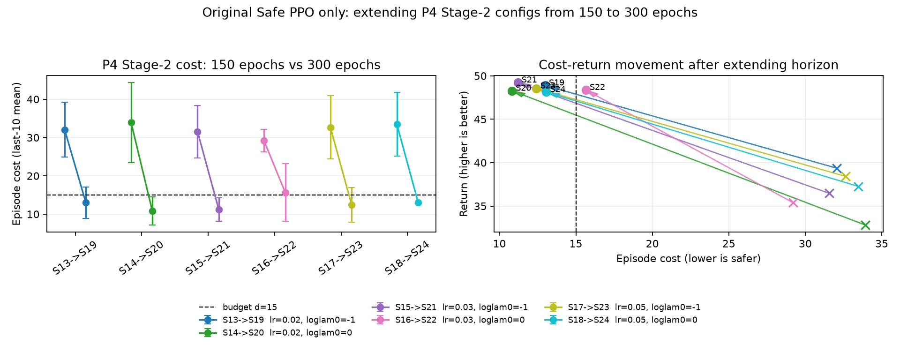

# Stage 2 P4 300-epoch extension

This repeats the original P4 Stage-2 block (S13-S18) with the original Safe PPO
implementation and only one intended change: `epochs: 150 -> 300`. The new IDs
S19-S24 map one-to-one onto S13-S18.

Summary: 5/6 extended P4 configs meet the cost budget by mean cost;
all six solve at full return. S22 is the only mean-cost miss (15.6) and is driven
by one high-cost seed.

| 150ep | 300ep | lam_lr | log_lam0 | 150 cost | 300 cost | 150 return | 300 return | 300 solved | pass |
|---|---|---:|---:|---:|---:|---:|---:|---:|---|
| S13 | S19 | 0.02 | -1 | 32.1 +/- 7.1 | 13.0 +/- 4.1 | 39.4 +/- 7.5 | 48.9 +/- 0.3 | 1.00 | yes |
| S14 | S20 | 0.02 | 0 | 33.9 +/- 10.4 | 10.8 +/- 3.7 | 32.8 +/- 12.2 | 48.3 +/- 1.7 | 1.00 | yes |
| S15 | S21 | 0.03 | -1 | 31.6 +/- 6.9 | 11.2 +/- 3.1 | 36.5 +/- 11.5 | 49.2 +/- 0.7 | 1.00 | yes |
| S16 | S22 | 0.03 | 0 | 29.2 +/- 3.0 | 15.6 +/- 7.5 | 35.4 +/- 15.8 | 48.4 +/- 0.8 | 1.00 | no |
| S17 | S23 | 0.05 | -1 | 32.6 +/- 8.3 | 12.4 +/- 4.5 | 38.4 +/- 9.8 | 48.5 +/- 0.7 | 1.00 | yes |
| S18 | S24 | 0.05 | 0 | 33.5 +/- 8.3 | 13.1 +/- 0.3 | 37.3 +/- 10.3 | 48.1 +/- 1.1 | 1.00 | yes |

Seed-level note: S22 has seed costs 12.1, 8.7, 26.1; the third seed is the reason its mean remains slightly above 15.
